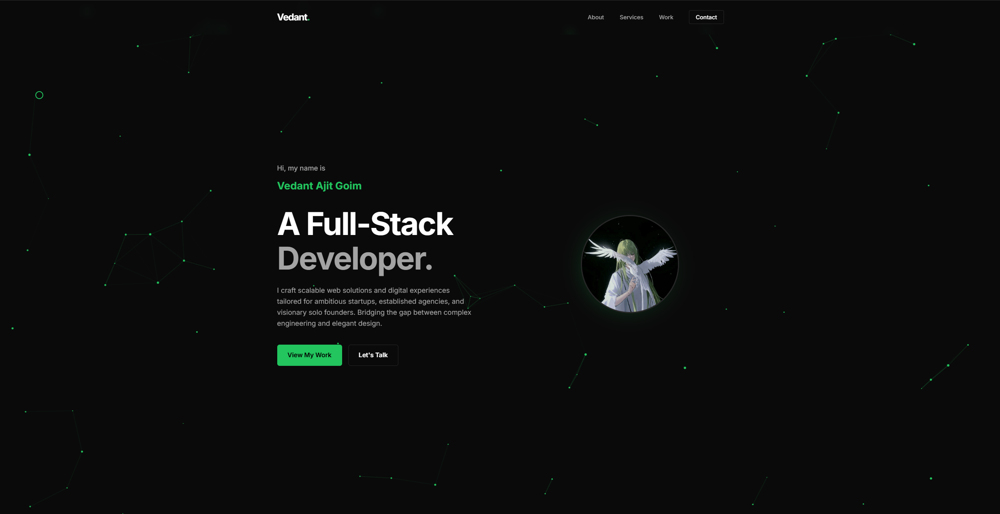

# Vedant Ajit Goim | Full-Stack Developer Portfolio

A premium, high-performance digital portfolio designed to showcase modern web engineering and sophisticated UI/UX. Built with a focus on visual excellence, fluid animations, and interactive storytelling.

 *(Note: Add a high-quality preview image in the public folder)*

## Vision

This project transcends traditional web design by merging complex backend logic with ethereal, front-end visual experiences. It’s engineered for those who demand more than just a website—they demand a digital presence that resonates.

## Tech Stack

- **Core**: [React 19](https://react.dev/) & [Vite 8](https://vitejs.dev/)
- **Animations**: [GSAP](https://gsap.com/) (GreenSock Animation Platform)
- **Smooth Scrolling**: [Lenis](https://github.com/darkroomengineering/lenis)
- **Visuals**: WebGL & Interactive Particle Systems
- **Styling**: Vanilla CSS with a focus on Grid/Flexbox and Glassmorphism

## Key Features

- **Fluid Motion**: Integrated Lenis for a cohesive, inertia-based scrolling experience throughout the application.
- **Narrative Reveal**: Scroll-triggered GSAP animations that reveal content with precision and elegance.
- **Interactive Aura**: A custom-built particle background that responds to user movement, creating a living digital environment.
- **Glassmorphism UI**: A consistent design language utilizing blurred backdrops and subtle borders for a modern, premium feel.
- **Adaptive Performance**: Highly optimized for speed and fully responsive across all screen dimensions.

## Featured Projects

### [TrenchKidd](https://github.com/goim-ved/trenchkidd)
> **High-End E-commerce Platform**
> A seamless shopping experience for a premium clothing brand, featuring immersive WebGL visuals and fluid transitions.
> **Tech**: MERN, WebGL, Framer Motion

### [EstateEdge](https://github.com/goim-ved/estateedge)
> **Real Estate Marketplace Monolith**
> A comprehensive tool for solo brokers, enabling efficient property management and high-performance search capabilities.
> **Tech**: MERN, PostgreSQL, Cloudinary

## Local Development

Follow these steps to get the environment set up on your local machine:

1. **Clone the repository:**
   ```bash
   git clone https://github.com/goim-ved/my-portfolio.git
   ```
2. **Navigate to the project directory:**
   ```bash
   cd my-portfolio
   ```
3. **Install dependencies:**
   ```bash
   npm install
   ```
4. **Launch the development server:**
   ```bash
   npm run dev
   ```

## License

Distributed under the MIT License. See `LICENSE` for more information.

---

Built by [Vedant Ajit Goim](https://github.com/goim-ved)
